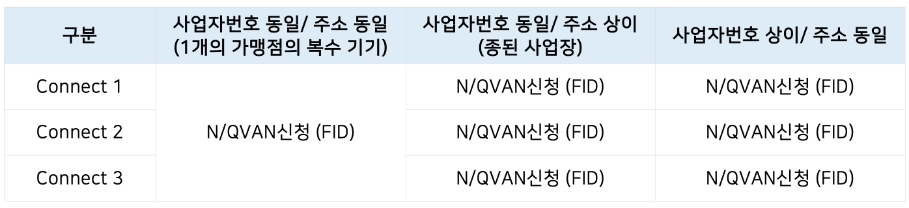

# 네이버커넥트 단말기


결제 가능한 단말기 기종 - TMS 최신 버전으로 업그레이드 필요\
<mark style="color:orange;">**연동 기종: MIT- 4000, NC-8000P, NPC-1000, NC-7000, NPC-2000, MIT- 3000, MIT- 7000**</mark>


네이버커넥트- NPC 1000 단말기 설치 동영상

[네이버커넥트 설치동영상 바로 가기 ](https://youtu.be/wXMpRJTAh8A)

NVAN - NPAY 가입 신청 시 주의 사항

<mark style="color:$danger;background-color:orange;">**💡**</mark> <mark style="color:orange;">**네이버페이 가맹점 심사 후 반려 또는 보류된 경우, 재심사 요청은 반드시 N/Q-VAN 시스템을 통해 진행해주시기 바랍니다.**</mark>

N/Q-VAN 가맹 신청 관련 문의는 커넥트 고객센터(1551-1784)로 부탁드립니다.

네이버페이 고객센터(1599-1598)는 심사 보류 또는 반려 사유에 대한 문의만 답변이 가능하며,

그 외 신청 관련 문의에는 답변이 불가하오니 반드시 커넥트 고객센터로 문의 부탁드립니다.

또한, 가맹점주가 아닌 밴 대리점에서 네이버페이 고객센터에 상담을 진행할 경우에는

정확한 확인을 위해 N/Q-VAN 신청 시 사용한 네이버 아이디와 발급된 FID를 함께 전달해 주셔야 원활한 안내가 가능합니다.

<mark style="color:$danger;background-color:orange;">**💡**</mark> 가입 신청이 완료되면 심사 진행 상태는 아래 경로를 통해 확인하실 수 있습니다.

1. 가입 신청 시 제출한 담당자의 이메일로 전송됩니다.
2. N/Q-VAN 시스템에서 결과 확인 가능합니다. (심사 결과는 약 1시간 단위로 갱신되므로 시차가 있을 수 있습니다. 이 경우 N/Q-VAN에서 직접 확인해 주세요.)
3. 커넥트 파트너를 통해서도 확인 가능합니다.

⭐ 심사 완료 후 네이버페이센터에서 가맹점주님의 이메일로 KYC(고객확인제도) 이행 안내 메일과 문자가 발송될 수 있습니다.  \
**단, 커넥트 가맹점은 네이버페이가 직접 정산을 수행하지 않기 때문에 KYC(고객확인제도)를 별도로 이행하지 않으셔도 됩니다. 메일과 문자에 기재된 ‘정산 중지’ 문구는 네이버페이 직접 정산 가맹점에만 해당되는 내용으로, 커넥트 가맹점주님께는 적용되지 않음을 “꼭” 함께 안내해주시기 바랍니다.** 🙏

#### 심사 기준

\* 해당 기준은 운영 상황에 따라 달라질 수 있습니다.

| **심사 항목** | **기준**                                                                                                                                                 | **비고**   |
| --------- | ------------------------------------------------------------------------------------------------------------------------------------------------------ | -------- |
| 매장 실체     | 매장 외관·내부 확인 가능해야 함                                                                                                                                     | 사진 필수    |
| 사업자 정보    | 사업자등록증 정보와 NVAN/QVAN 신청정보 일치                                                                                                                           | 불일치 시 반려 |
| 간판/상호명    | ⭐️ <mark style="color:orange;">**실제 간판명과 신청 상호명 동일 필수**</mark>  신청서에 입력한 상호명과 실제 매장에 설치된 간판명이 서로 다를 경우 가맹 신청이 보류될 수 있습니다. 상호명은 꼭 ‘간판’과 동일하게 작성 부탁드립니다. | 불일치 시 보류 |
| 기타        | 허위 정보, 불법/비정상 사업장 등                                                                                                                                    | 반려 처리    |

#### <mark style="color:orange;">**가입 불가 업종**</mark>

**아래 업종에 해당하는 경우, 서비스 정책상 가입이 제한되며 신청이 반려될 수 있습니다.**

* 유흥업종: 단란주점, 무도 유흥주점, 클럽, 나이트 등
* 성인 관련 : 음란물/성매매/성인용품 등 성인인증을 필요로 하는 업종
* 도박 관련(사행성): 카지노, 경마, 경륜, 복권 판매, 도박기계 판매업
* 기타 : 미등록 다단계, 방문판매업, 위조품(짝퉁) 및 저작권 침해 물품 판매, 대부업자/환전상 등
* 마약, 총포, 도검류, 의약품판매(허가 없는 경우), 현행 국군 군복, 상품권, 포인트, 캐쉬 및 이와 유사 상품

**회사의 평판을 훼손할 우려가 있거나, 구매자 민원 발생 가능성이 높은 업종의 경우 서비스 제공 범위가 불명확하여 민원 처리에 어려움이 있거나 구매자에게 수익을 보장하는 형태 등 사회적 이슈 발생 가능성이 있는 업종으로 판단될 경우 가입이 제한될 수 있습니다.**

**비영리법인 안내**

비영리법인의 경우에도 사업자등록증을 보유하고 있다면 사업자등록증을 첨부해 주시기 바랍니다.

비영리법인은 실제 거래 발생 여부 및 제출 서류를 기준으로 심사를 진행하며, 심사 결과에 따라 승인 여부가 결정됩니다.

#### 사진첨부 (2장)

**⭐️ 직접 찍은 사진을 첨부해 주셔야 합니다.**

* 외부: 간판이 확인되는 건물/ 상가 전경
  * 로드뷰를 첨부해주셨거나 첨부해주신 사진에서 매장 실체 확인이 어려운 경우 보류 또는 반려 처리 될 수 있습니다.
* 내부: 내부가 보이도록 찍은 사진 (영업 업종이 사업자등록증상의 영업 업종과 동일한지 확인하기 위함)

가입 프로세스

💡 간편 등록 가이드\
&#x20;     NVAN - Npay 신청 → 페이센터 파트너 서비스 회원가입 및 가맹점 등록 → 설치

### <mark style="color:orange;">1. NVAN</mark>

<figure><figcaption></figcaption></figure>

<figure><figcaption></figcaption></figure>

<figure><figcaption></figcaption></figure>

### <mark style="color:orange;">2. 페이센터 파트너 서비스 (회원가입/가맹점 등록)</mark>



<figure><figcaption></figcaption></figure>

<figure><figcaption></figcaption></figure>

<figure><figcaption></figcaption></figure>

<figure><figcaption></figcaption></figure>

<figure><figcaption></figcaption></figure>

*   ~~**가입 신청서 내 해당 사업자의 정확한 네이버 ID를 작성해주세요.**~~

    **📌 2026.07.14 기준 변경: N/Q-VAN에서 ‘네이버 ID’를 받지 않습니다.**
* <mark style="color:green;">**사업자 정보/ 담당자 정보/ 가맹점 정보**</mark>**를 작성해주세요.**
  * 입력하신 정보는 추후 공지사항 전달 및 네이버페이 심사에 사용됩니다.
  * **사업자등록증 및 영업신고증 상의 정보와 일치해야 하며**, 부정확한 정보 입력 시 심사가 반려될 수 있습니다.
  * 정확한 휴대전화번호를 작성해주세요. 해당 번호로 주요 안내사항이 발송됩니다.
*   ~~**정산정보를 작성해주세요.**~~

    **📌 2026.07.14 기준 변경: N/Q-VAN에서 '계좌 정보’를 받지 않습니다.**
* <mark style="color:green;">**기타 입점 정보**</mark>**를 작성해주세요.**
  * Npay connect 사용여부와 문화소득공제여부 항목에 대해 꼭 정확히 선택해주세요. 실제 운영 기준에 따라 정확히 선택해 주셔야 합니다.
* <mark style="color:green;">**계약 사항과 약관 및 동의 상세 내용을 확인 후 동의**</mark>**해주세요**
  * \*표시 항목은 필수 동의 항목입니다.

### <mark style="background-color:pink;">자주 놓치는 포인트!🚨</mark>

앞서 말씀드린 내용을 다시 한 번 강조드립니다 😊

심사 지연이나 불필요한 문의가 발생하는 주요 원인입니다. 신청 전 꼭 다시 한 번 확인해주세요!

* **사업자 정보 불일치** → 사업자등록증의 상호·대표자·번호와 동일하게 입력 (단, 상호명은 간판과 동일하게 입력!)
* **간판/매장 실체 불분명** → 외부(간판 포함)·내부 사진 모두 원본으로 첨부 (간판이 없을 경우 오픈 예정 현수막 등 첨부!)
* **추가서류 누락** → 일부 업종은 영업신고증 등 서류 필수
* **커넥트 미사용 매장 신청** → 실제 커넥트를 사용하지 않는 매장은 신청 대상 아님
* **KYC 안내 메일 혼동** → 커넥트 가맹점은 KYC 이행 대상이 아니므로 무시 가능하다고 가맹점주에게 꼭 안내!

***

💡**사업자/ 주소 기준 N/QVAN 신청 기준**

<figure><figcaption></figcaption></figure>

* 같은 사업자(동일 사업자번호, 동일 주소)의 가맹점에서 커넥트 단말기를 여러 대 사용하는 경우, N/QVAN 가입 신청은 1회만 진행하면 됩니다.
  * 가맹점 가입 신청: N/QVAN 가입신청(FID) 1회 진행
  * 단말기 추가: 커넥트 파트너스 어드민에서 단말기 추가 등록
  * 단말기별로 VAN TID가 다른 경우, 단말기 등록 시 해당 단말기에 맞는 TID를 각각 입력하여 등록
*   사업자번호는 동일하지만 주소가 다른 경우

    → 각 주소별로 N/QVAN 가입 신청을 각각 진행하면 됩니다.
*   사업자번호가 다르고 주소가 동일한 경우

    → 사업자별로 N/QVAN 가입 신청을 각각 진행하면 됩니다.

***

#### 💡**TIP 1.**

관련하여 추가로 확인이 필요한 내용이 있을 경우,\
단말기 설치 및 이용, 네이버페이 가입 신청 절차 관련 문의는 커넥트 고객센터(1551-1784)\
네이버페이 가입 심사 보류/반려 사유는 네이버페이 고객센터(1599-1598)로 문의해 주세요.

#### 💡**TIP 2.**

> **📌 2026.04.16 기준 변경: 매장사진 제출 기준이 스마트플레이스 등록 여부에 따라 변경되었습니다.**

#### 1. 매장사진 제출 기준

매장사진 제출 여부는 **스마트플레이스 등록 여부 기준**으로 판단됩니다.

| **구분**                  | **사진 제출**         |
| ----------------------- | ----------------- |
| 스마트플레이스 등록 매장 → 등록 확인 시 | **매장사진 없이 접수 가능** |
| 스마트플레이스 미조회 매장          | **매장사진 2장 필수 제출** |

매장사진 2장을 제출하시는 경우 기존과 동일한 기준으로 심사가 진행됩니다.

#### 2. 접수 전 확인 방법

접수 전 아래 경로를 통해 스마트플레이스 등록 여부를 먼저 확인 부탁드립니다.

* **확인 링크**: [https://new.smartplace.naver.com/bizes/lookup](https://new.smartplace.naver.com/bizes/lookup)
* **확인 방법**: 사업자번호 / 전화번호 / 매장명 중 1개 입력하여 조회 가능합니다.
* 스마트플레이스에 조회되지 않을 경우 스마트플레이스에 등록하실 수 있습니다.
* **등록가이드**: [https://new.smartplace.naver.com/help/guide?menu=register](https://new.smartplace.naver.com/help/guide?menu=register)

#### 3. 빠른 심사를 위한 안내

스마트플레이스에서 조회되지 않는 매장은 → **매장사진 2장 제출을 권고**드립니다.\
(사진 미제출 시 보류될 수 있습니다)

#### 4. 유의사항

* 네이버 지도에 매장이 노출되더라도 → **스마트플레이스에 등록되지 않은 경우가 있습니다.**
* 아래와 같은 경우 추가 자료 요청이 발생할 수 있습니다:
  * → 스마트플레이스 등록 정보(대표자, 사업장 소재지 등)와 제출 정보 불일치 시

결제단말기 연결 및 설치

<mark style="background-color:orange;">💡</mark> **주요 사항**

* 멀티패드로 사용할 경우, 기존 멀티패드(서명패드)를 제거하고 Npay connect를 연결해주세요.
* 멀티패드를 이미 쓰고 있는 경우, 설정 변경 없이 바로 Npay connect가 연결됩니다.
* <mark style="color:red;">**페이스사인 등 다양한 Npay connect 기능을 사용하기 위해 결제 단말기를 꼭 최신 버전으로 펌웨어 업데이트를 진행해주세요.**</mark>
* [<mark style="color:$info;">**기종별 업그레이드 번호 확인 ← 클릭**</mark>](../undefined-2/tms.md)

1. 결제 단말기와 연결 시, RJ9선을 통해 Npay connect와 서로 연결되어 있어야 합니다.

* <mark style="background-color:$info;">PAD 단자는 Npay connect</mark> 단말기에 / <mark style="background-color:$info;">CAT-RJ9 단자는 결제단말기(캣단말기)</mark>에 연결해주세요.

<figure><figcaption></figcaption></figure>

2. 기존에 결제 단말기에 멀티(서명)패드를 연결하여 사용하셨던 매장

* 기존 멀티(서명)패드 제거 후, Npay connect를 연결해주시면 사용가능합니다.

3. 신규 매장 또는 멀티(서명)패드를 미사용 하던 매장

* 결제 단말기에서 멀티(서명)패드를 설정해주셔야 합니다

| **단말기**                                                                                  | **멀티(서명)패드 연결 방법 / 통합결제 설정 방법**                                                                                                                                                                                                                                                                                                                                                                                                                                                                                                                                                                                                                                                                                                                                                                                                                                                                                                                                                                                                                                                                                                                                                                                                                                                                                         |
| ---------------------------------------------------------------------------------------- | ----------------------------------------------------------------------------------------------------------------------------------------------------------------------------------------------------------------------------------------------------------------------------------------------------------------------------------------------------------------------------------------------------------------------------------------------------------------------------------------------------------------------------------------------------------------------------------------------------------------------------------------------------------------------------------------------------------------------------------------------------------------------------------------------------------------------------------------------------------------------------------------------------------------------------------------------------------------------------------------------------------------------------------------------------------------------------------------------------------------------------------------------------------------------------------------------------------------------------------------------------------------------------------------------------------------------- |
| 
<strong>MIT-4000</strong> <strong>NC-8000</strong> <strong>NC-7000</strong>
 | 
<strong>1. 서명패드 연결을 합니다.</strong> 결제 단말기의 <code>[정정]</code> 버튼 → 비밀번호 <code>[6423]</code> 입력 → <code>[9.부가기능2]</code> 9번 버튼 → <code>[1.서명패드]</code> 1번 버튼 → 서명패드 사용 <code>[1.사용]</code> 1번 버튼 → (<strong>NC-7000/ NPC-2000 일 경우</strong> 서명 반전여부 <code>[1.사용]</code> 1번 버튼 → 외장형 서명패드사용 <code>[1.사용]</code> 1번 버튼) → 서명패드 <code>[4.115200]</code> 4번 버튼 → <code>[입력]</code> 버튼 → 서명패드에 가맹점명 전송 <code>[0.예]</code> 0번 버튼 → 현금영수자료입력 서명패드 사용 <code>[1.사용]</code> 1번 버튼   Paypro 설정 <code>[1.멀티패드]</code> 1번 버튼 → 멀티패드연동포트 설정<code>[1.핀패드]</code>  <strong>2. 상호인증 연결을 합니다.</strong> 결제 단말기의 <code>[2. NFC멀티패드]</code> 2번 버튼 → NFC멀티패드 사용 <code>[1.사용]</code> 1번 버튼 → NFC멀티패드 PORT <code>[1.핀패드]</code> 1번 버튼 → NFC멀티패드 <code>[4.115200]</code> 4번 버튼 → NFC멀티패드 연결중 → NFC멀티패드 상호인증 성공 → 설정화면 이동 → <code>[종료]</code> 버튼  <strong>2-1. 상호인증 연결을 합니다.(2번 안될 경우)</strong>결제 단말기의 <code>[정정]</code> 버튼 → 비밀번호 <code>[6423]</code> 입력 → <code>[9.부가기능2]</code> 9번 버튼 → <code>[2. NFC멀티패드]</code> 2번 버튼 → NFC멀티패드 사용 <code>[1.사용]</code> 1번 버튼 → NFC멀티패드 PORT <code>[1.핀패드]</code> 1번 버튼 → NFC멀티패드 <code>[4.115200]</code>4번 버튼 → NFC멀티패드 연결중 → NFC멀티패드 상호인증 성공 → 설정화면 이동 → <code>[종료]</code> 버튼  <strong>3. 암호화키 다운로드</strong> 결제 단말기의 [등록] 버튼 → [3.암호키다운로드] 3번 버튼 → [1.리더기 키다운로드]
 |
| 
<strong>NPC-1000</strong> <strong>NPC-2000</strong>
                            | 
<strong>1. 서명패드 연결을 합니다.</strong> 결제 단말기의 <code>[정정]</code> 버튼 → <code>[5.부가장비설정]</code> 5번 버튼 → <code>[1.서명패드 및 리더기]</code> 1번 버튼 → 서명패드 사용 <mark style="background-color:$info;"><code>[1.사용]</code></mark> 1번 버튼 → 서명패드에 가맹점명 전송 <code>[1.예]</code> 1번 버튼 → 리더기/멀티패드 설정 <code>[1.사용]</code> 1번 버튼 → 카드리더기 상시대기 <mark style="background-color:$info;"><code>[1.사용]</code></mark> 1번 버튼
                                                                                                                                                                                                                                                                                                                                                                                                                                                                                                                                                                                                                                                                                                                                                                                                                                                                                                                      |

☑️ FAQ (오류 해결 방법)

* **Npay connect를 첫 실행했는데, \[Npay payment이(가) 중지됨] 이 나타나서 사용할 수 없어요.**
  * <mark style="background-color:$info;">앱정보</mark> 선택 > <mark style="background-color:$info;">저장용량 및 캐시</mark> 선택 > <mark style="background-color:$info;">저장용량 지우기</mark> 선택 > <mark style="background-color:$info;">소거</mark> 선택 > 커넥트 단말기의 좌측 상단 전원 버튼을 눌러 <mark style="background-color:$info;">재부팅</mark> 진행

<figure><figcaption></figcaption></figure>

* **Npay connect에서 유효하지 않은 토큰이라고 나타나서 매장 정보 페이지에서 넘어가지 않아요..**
  *   페이센터 파트너서비스 사이트에 단말기 추가되어 있는지 확인해주세요.

      최신버전의 앱으로 업데이트가 필요합니다. 와이파이 연결 후, 재부팅을 해주세요.
* **Npay connect 고객센터**
  *   📞 1551 - 1784 (운영시간 10\~19시, 주말/공휴일 포함)

      💬 궁금한 내용이 있으면 아래 채팅창을 통해서 문의주시면 빠른 상담이 가능합니다.
  * &#x20;[<mark style="color:$info;">**< 채팅 상담하기 >**</mark>](https://npayconnect.channel.io/home)

