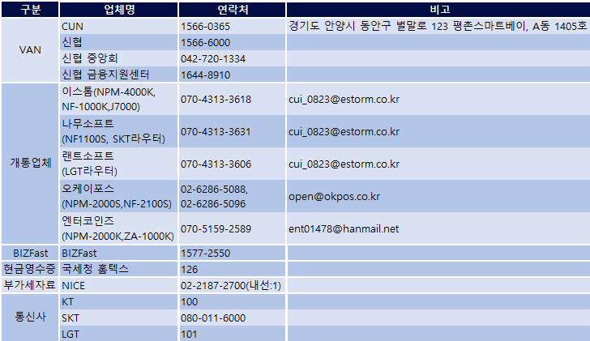

# 유관기관연락처

제조사 연락처


CUNIBS \[5100] 단말기 AS 등록 화면에서 모델 선택란에 없는 기종은
\
AS 등록 불가능한 기종이므로, 제조사로 발송 요망


<table><thead><tr><th width="200">기종</th><th width="169">업체/연락처</th><th width="318">주소</th></tr></thead><tbody><tr><td>MIT유선단말기 수리처 및 AS 단말기 집합소</td><td>훼스트
 031-423-1933</td><td>5100 접수건 문의시</td></tr><tr><td>J7000(S)/
NF-1000S(K)
 NF-2100S/
NF-2000S
 
NC-2000/NC-5000 NC-6000</td><td>OKPOS(무선AS)
 1599-9605</td><td>5100 접수건 문의시</td></tr><tr><td>ZA-1000K
 NPM-2000S NPM-2000K
 NM-300
 NM-2000BLE
 NM-2000NBLE</td><td>조아전자
 1661-5513 (내선1번)</td><td>경기도 안양시 만안구 전파로 53,  본관2층 201호(AS센터)</td></tr><tr><td>NM-400BLE
 NS-200QR
 NPC-1000QN
 NPS-100N</td><td>광우정보통신
 031-423-1500</td><td>경기도 안양시 동안구 벌말로 66,  평촌하이필드 A동 F1513호</td></tr><tr><td>NC-8000 NC-8000P
 NC-8000QN
 NC-7000
 NPM-3000S
 NK-2000QR
 NK-2500QR
 NK-2500QN
 NS-300QN
</td><td>에스씨에스프로
 070-8622-7490</td><td>서울시 금천구 가산디지털 1 로 204, 403호(가산동, 반도아이비밸리)</td></tr><tr><td>NPM-4000K
 NPC-2000QN
 NM-200BLE</td><td>제이티아이
 1670-0295</td><td>경기도 부천시 조마루로 385번길 122, 2204-5호(춘의동, 삼보테크노타워)</td></tr><tr><td>NM-1000BLE NM-100BLE</td><td>OKPOS 1599-9605</td><td>서울특별시 금천구 벚꽃로 234, 
에이스하이엔드타워 6차 106호</td></tr><tr><td>MSM-2000 MSM-2000BLE</td><td>체큐리티
 02-6736-6060</td><td>서울 금천구 디지털로 9길 68, 대륭포스트타워 5차 1304호</td></tr><tr><td>Npay connect</td><td>하나시스
 1800-1185</td><td>경기도 수원시 권선구 산업로 155
번길 17,  하나시스 고객지원팀 앞</td></tr><tr><td>LT5라우터</td><td>앰투앰넷 031-387-3311</td><td>경기도 안양시 동안구 평촌대로212번길 55 (관양동, 대고빌딩 10층)</td></tr><tr><td>TC700 라우터</td><td>텔라딘
 031-707-0741</td><td>경기도 성남시 분당구 판교로 253,  C동 1층 101호(삼평동,판교이노벨리)</td></tr><tr><td>SKT/LGT 라우터</td><td>씨앤에스링크
 1600-0719</td><td>경기도 성남시 중원구 갈마치로288번길 14,  성남SKV1타워 B동 1152호</td></tr><tr><td>SK 주유소 단말기</td><td>밸류이노베이션
 070-4352-5545</td><td>경기도 안양시 동안구 시민대로 361,  에이스평촌타워 1211호</td></tr></tbody></table>

카드사 연락처

<table><thead><tr><th width="260">카드사</th><th width="309">연락처</th></tr></thead><tbody><tr><td>BIZFast</td><td>1577-2550</td></tr><tr><td>BC</td><td>1588-4500</td></tr><tr><td>삼성</td><td>1588-8700</td></tr><tr><td>롯데</td><td>1588-8100</td></tr><tr><td>현대</td><td>1577-6000</td></tr><tr><td>국민</td><td>1588-1688</td></tr><tr><td>농협</td><td>1644-4000</td></tr><tr><td>하나</td><td>1800-1111</td></tr><tr><td>우리</td><td>1644-9797</td></tr><tr><td>신한</td><td>1544-7000</td></tr><tr><td>카카오페이</td><td>1644-7405 (ARS 2번 전화상담)</td></tr><tr><td>제로페이</td><td>1670-0582</td></tr><tr><td>페이프로</td><td><a href="mailto:paypro.service@nicepay.co.kr">paypro.service@nicepay.co.kr</a></td></tr><tr><td>토스페이</td><td>1644-4900</td></tr><tr><td>국세청 홈텍스</td><td>126</td></tr><tr><td>네이버페이 가맹</td><td>1599-1598</td></tr><tr><td>Npay connect 고객센터</td><td>1551-1784</td></tr></tbody></table>

바우처 및 복지카드 연락처

<table><thead><tr><th width="264">카드 종류</th><th width="259">연락처</th></tr></thead><tbody><tr><td>지드림</td><td>1577-8563</td></tr><tr><td>푸르미</td><td>070-4472-9104
 (1544-3674)</td></tr><tr><td>건강보험공단
 (임신,출산 진료비 신청,
이용문의)</td><td>1577-1000</td></tr><tr><td>문화누리카드</td><td>1544-3412</td></tr><tr><td>디지털온누리상품권</td><td>1670-1600</td></tr><tr><td>중소기업통합콜센터</td><td>1357</td></tr><tr><td>꿈자람</td><td>1644-3259</td></tr></tbody></table>

기타 연락처

<figure><figcaption></figcaption></figure>

